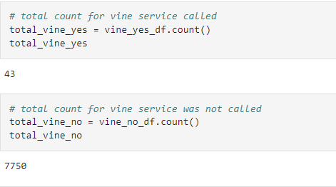
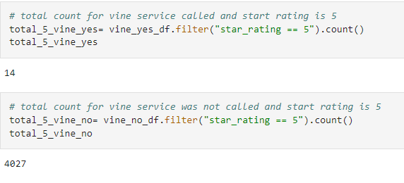
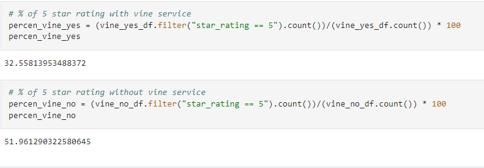

# Amazon_Vine_Analysis:

## 1. Overview of the analysis:
    we would like to analyze the data to determine if there is any bias involve between reviews were written as part of the vine program. we also need to check if how much % of 5 star reivews received with Vine program as well as Non Vine program.

## 2. Results:
*   How many Vine reviews and non-Vine reviews were there?

    
    We have observed under vine program total 43 reviews are obtained Vs. 7750 reviews without Vine program.

*   How many Vine reviews were 5 stars? How many non-Vine reviews were 5 stars?

    We have observed under Vine program total 14 reviews have 5 star rating Vs. total 4027 reviews have 5 star rating without Vine program.

*   What percentage of Vine reviews were 5 stars? What percentage of non-Vine reviews were 5 stars?

    We have observed total 32.56% of the 5 start review ratings are obtained under the Vine program. However total 51.96% of 5 start review rating are obtained.

## 3. Summary:
    On base of data analysis result, it is observed that under the Vine program total 32.56% of 5 star reviews are obtained Vs. total 51.96% of 5 start reviews are obtained without Vine program. So we can say there is no bias with paid Vine program to obtained 5 start rating.
    It is also observed that total 4041 5-start reviews are observed out of 7793 reviews. Total 14 5-start reviews with Vine program Vs. 4027 5-start review obtained without Vine program.